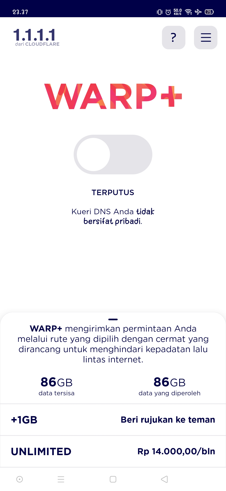

<H1 align="center">
WARP+ Bot Auto Invite
</H1>

<p align="center">
  <a><br> SCREENSHOT </br></a>
  <br>
  
</p>

## Installation

```terminal
$ git clone https://github.com/hunternblz/Warp-Bot.git
$ cd Warp-Bot
```

## Usage

```php
$ php warp.php
```

## How to Get Client ID WARP

Step 1 : Open the application 1.1.1.1
<br>
Step 2 : Get your Client ID by going to Settings > More Settings > Diagnostics > ID

